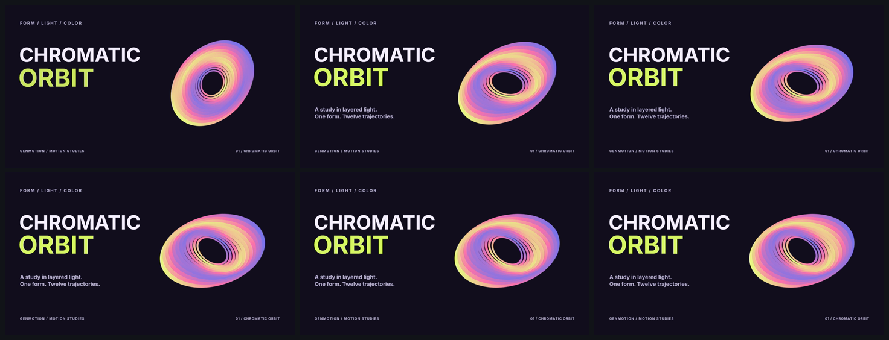
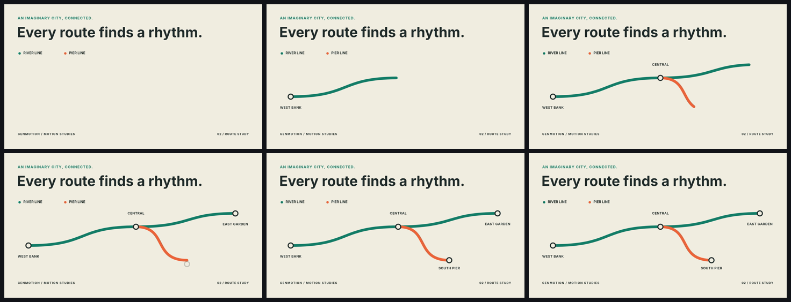
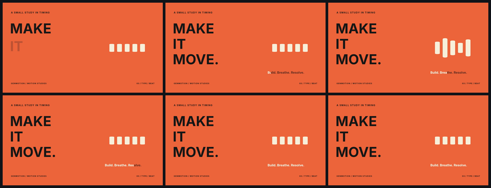

# Public examples

These are complete, editable Creative IR projects, not screenshots of a separate renderer. Each directory includes its source project, frozen assets, creative brief, selected concept record, high-quality 1920×1080 H.264 master, and inspected contact sheet.

| Project | What it proves | Source | Master |
| --- | --- | --- | --- |
| Kinetic Type | clipped typography, custom cubic easing, spring timing, letter-spacing animation, and connected scene transitions | [`kinetic-type/genmotion.json`](kinetic-type/genmotion.json) | [`kinetic-type.mp4`](kinetic-type/kinetic-type.mp4) |
| Data Pulse | animated counters, converging signal fields, native SVG path drawing, luminous blend modes, and an editorial conclusion | [`data-pulse/genmotion.json`](data-pulse/genmotion.json) | [`data-pulse.mp4`](data-pulse/data-pulse.mp4) |
| Arc One | original vector product geometry, shadows, blend modes, macro transforms, stable lockup timing, and a mixed stereo AAC soundtrack | [`arc-one/genmotion.json`](arc-one/genmotion.json) | [`arc-one.mp4`](arc-one/arc-one.mp4) |
| Native Milestones | reusable compositions, variants, path motion, captions and transitions | [`native-milestones/genmotion.json`](native-milestones/genmotion.json) | [`native-milestones.mp4`](native-milestones/native-milestones.mp4) |
| Animation Kernel | typed animation, spring timing, stagger, inheritance and constraints | [`animation-kernel/genmotion.json`](animation-kernel/genmotion.json) | [`animation-kernel.mp4`](animation-kernel/animation-kernel.mp4) |
| Chromatic Orbit | layered ring primitives, gradient paint, independent rotations and a settled final pose | [`chromatic-orbit/genmotion.json`](chromatic-orbit/genmotion.json) | [`chromatic-orbit.mp4`](chromatic-orbit/chromatic-orbit.mp4) |
| Route Study | shared anchors, native Bezier drawing, staged station labels and schematic information hierarchy | [`route-study/genmotion.json`](route-study/genmotion.json) | [`route-study.mp4`](route-study/route-study.mp4) |
| Type / Beat | oversized typography, original synthesized audio, authored beat timing and karaoke highlighting | [`type-beat/genmotion.json`](type-beat/genmotion.json) | [`type-beat.mp4`](type-beat/type-beat.mp4) |

## Render evidence

### Kinetic Type


### Data Pulse


### Arc One


### Chromatic Orbit



### Route Study



### Type / Beat



The three motion studies are each eight seconds at 1920×1080 and 30 FPS. Each uses one continuous scene with a final hold. Type / Beat has an original percussion-and-tone soundtrack, not narration; its visual meters use the authored beat schedule rather than automatic audio analysis. Route Study describes a fictional city. Their `render-report.json` files record strict validation, encoded metadata and full-decode results.

## Reproduce

Rebuild and render just these studies:

```bash
npm run build
node scripts/build-gallery-examples.mjs
node scripts/render-gallery-examples.mjs
node scripts/verify-gallery-examples.mjs
```

Use `node scripts/render-gallery-examples.mjs --stills` for native frame review, or pass one or more study IDs to render a subset.

Verification decodes all 240 frames in each study, rejects blank or unexpectedly static output, checks random-seek pixel equality, and measures the encoded soundtrack for clipping and clean edges. Source, master and contact-sheet hashes are recorded in each report. Native review frames and final encoded contact sheets were visually inspected; the single-scene designs have no inter-scene transition seams.

Rebuild the broader gallery:

```bash
npm ci
npm run examples:build
node dist/cli.js validate examples/arc-one --strict
node dist/cli.js render examples/arc-one --output examples/arc-one/arc-one.mp4 --quality high
node dist/cli.js contact-sheet examples/arc-one/arc-one.mp4 --output examples/arc-one/contact-sheet.png
npm run examples:verify
```

`examples:build` recreates the JSON projects and deterministic original soundtrack. It does not fetch remote media. The checked-in Inter variable font is distributed under the SIL Open Font License in each project's `assets/OFL.txt`; the frozen font file has SHA-256 `29160A80FF49DDCAB2C97711247E08B1FAB27A484A329CE8B813D820DC559031` and comes from the official [Google Fonts Inter directory](https://github.com/google/fonts/tree/main/ofl/inter).

The example claims describe only what their checked-in Creative IR and native outputs demonstrate. Arc One is fictional, and its vector design and soundtrack were authored specifically for this repository.
