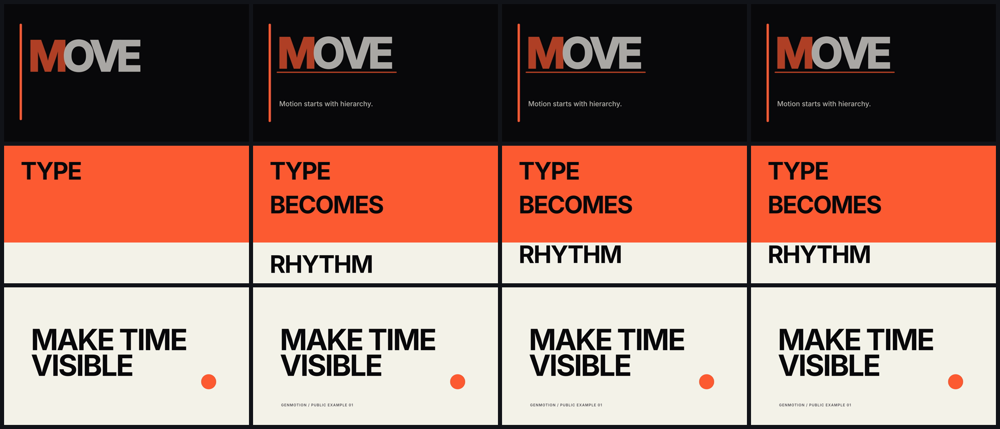
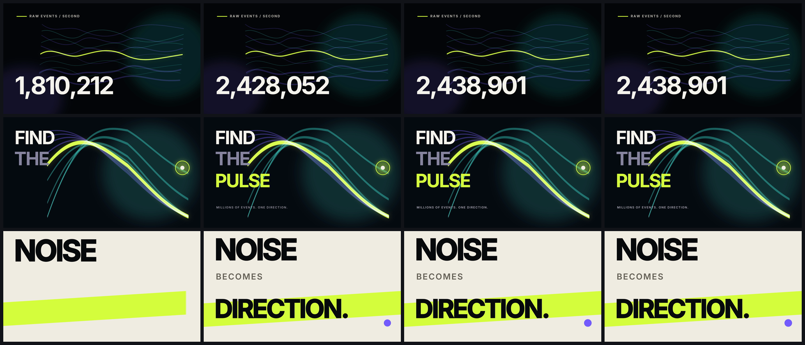
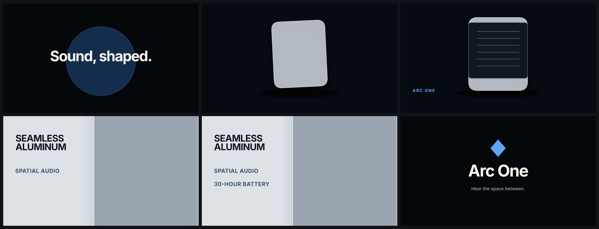

# Public examples

These are complete, editable Creative IR projects, not screenshots of a separate renderer. Each directory includes its source project, frozen assets, creative brief, selected concept record, high-quality 1920×1080 H.264 master, and inspected contact sheet.

| Project | What it proves | Source | Master |
| --- | --- | --- | --- |
| Kinetic Type | clipped typography, custom cubic easing, spring timing, letter-spacing animation, and connected scene transitions | [`kinetic-type/genmotion.json`](kinetic-type/genmotion.json) | [`kinetic-type.mp4`](kinetic-type/kinetic-type.mp4) |
| Data Pulse | animated counters, converging signal fields, native SVG path drawing, luminous blend modes, and an editorial conclusion | [`data-pulse/genmotion.json`](data-pulse/genmotion.json) | [`data-pulse.mp4`](data-pulse/data-pulse.mp4) |
| Arc One | original vector product geometry, shadows, blend modes, macro transforms, stable lockup timing, and a mixed stereo AAC soundtrack | [`arc-one/genmotion.json`](arc-one/genmotion.json) | [`arc-one.mp4`](arc-one/arc-one.mp4) |

## Render evidence

### Kinetic Type



### Data Pulse



### Arc One



## Reproduce

```bash
npm ci
npm run examples:build
node dist/cli.js validate examples/arc-one --strict
node dist/cli.js render examples/arc-one --output examples/arc-one/arc-one.mp4 --quality high
node dist/cli.js contact-sheet examples/arc-one/arc-one.mp4 --output examples/arc-one/contact-sheet.png
npm run examples:verify
```

`examples:build` recreates the JSON projects and deterministic original soundtrack. It does not fetch remote media. The checked-in Inter variable font is distributed under the SIL Open Font License in each project's `assets/OFL.txt`; the frozen font file has SHA-256 `29160A80FF49DDCAB2C97711247E08B1FAB27A484A329CE8B813D820DC559031` and comes from the official [Google Fonts Inter directory](https://github.com/google/fonts/tree/main/ofl/inter).

The example claims describe only what their checked-in Creative IR and native outputs demonstrate. Arc One is fictional, and its vector design and soundtrack were authored specifically for this repository.
