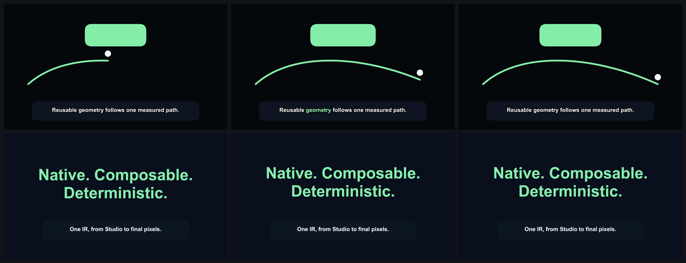
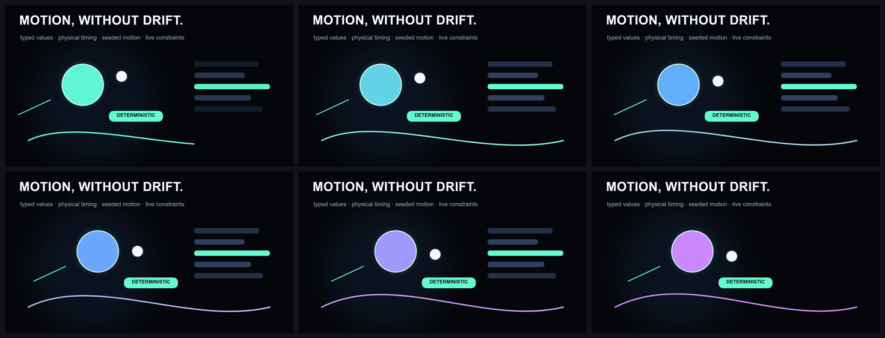
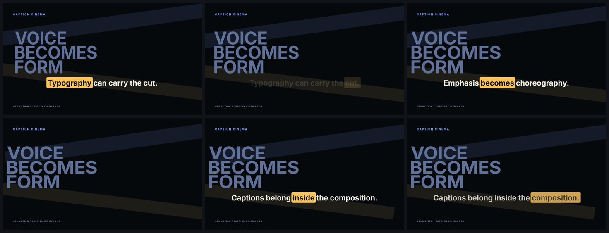
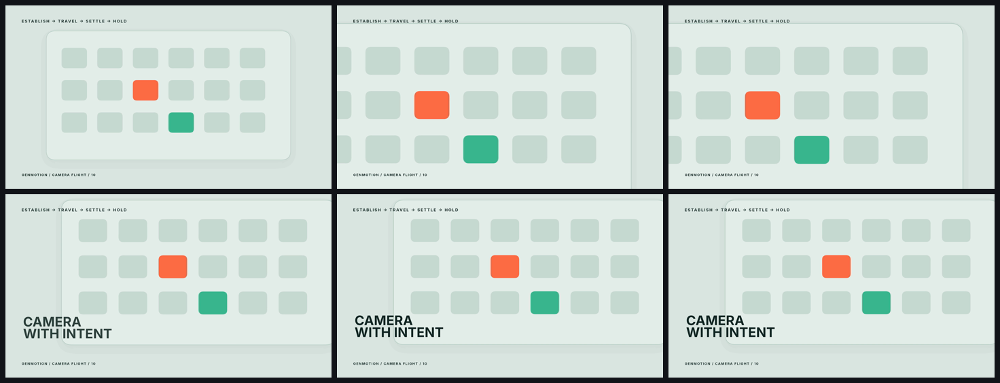
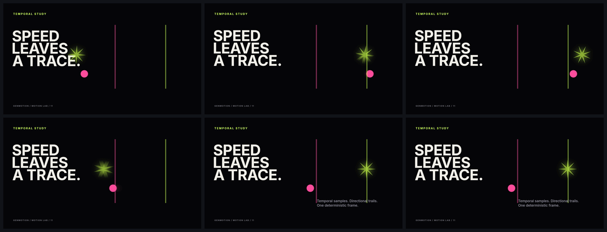

# Public examples

The gallery contains eleven complete, editable Creative IR projects. Every directory includes the authored project, local font and license, creative brief, two contrastive concept directions, a high-quality 1920×1080 H.264 master, a contact sheet, representative native review frames, and a render attestation.

| Project | Native feature focus | Source | Master |
| --- | --- | --- | --- |
| Kinetic Type | Monumental type, custom easing, contained editorial reframing and an original electronic launch bed | [`kinetic-type/genmotion.json`](kinetic-type/genmotion.json) | [`kinetic-type.mp4`](kinetic-type/kinetic-type.mp4) |
| Data Pulse | Animated numeric formatting, area charts, gradient paint and temporally sampled signal motion | [`data-pulse/genmotion.json`](data-pulse/genmotion.json) | [`data-pulse.mp4`](data-pulse/data-pulse.mp4) |
| Arc One | Original identity geometry, gradient rings, glow, macro movement and a restrained electronic launch bed | [`arc-one/genmotion.json`](arc-one/genmotion.json) | [`arc-one.mp4`](arc-one/arc-one.mp4) |
| Native Milestones | Multiple scenes, typed variants, frame-exact cuts and boundary review | [`native-milestones/genmotion.json`](native-milestones/genmotion.json) | [`native-milestones.mp4`](native-milestones/native-milestones.mp4) |
| Animation Kernel | Keyframes, stagger metadata, temporal trails and structured motion | [`animation-kernel/genmotion.json`](animation-kernel/genmotion.json) | [`animation-kernel.mp4`](animation-kernel/animation-kernel.mp4) |
| Chromatic Orbit | Twelve independent gradient rings, rotation tracks, selective motion blur and tonal pulse audio | [`chromatic-orbit/genmotion.json`](chromatic-orbit/genmotion.json) | [`chromatic-orbit.mp4`](chromatic-orbit/chromatic-orbit.mp4) |
| Route Study | Shared anchors, measured Bezier drawing and staged semantic labels | [`route-study/genmotion.json`](route-study/genmotion.json) | [`route-study.mp4`](route-study/route-study.mp4) |
| Type / Beat | Oversized type, a shared 120 BPM cue grid, transient-driven meter motion and kinetic captions | [`type-beat/genmotion.json`](type-beat/genmotion.json) | [`type-beat.mp4`](type-beat/type-beat.mp4) |
| Caption Cinema | Language-filtered editorial captions, style presets, word emphasis and cue animation | [`caption-cinema/genmotion.json`](caption-cinema/genmotion.json) | [`caption-cinema.mp4`](caption-cinema/caption-cinema.mp4) |
| Camera Flight | Establish, travel, settle and hold camera choreography with hierarchy-aware blur and a paced launch bed | [`camera-flight/genmotion.json`](camera-flight/genmotion.json) | [`camera-flight.mp4`](camera-flight/camera-flight.mp4) |
| Motion Lab | Motion blur, independent trails, glow, chromatic aberration and a high-energy electronic bed | [`motion-lab/genmotion.json`](motion-lab/genmotion.json) | [`motion-lab.mp4`](motion-lab/motion-lab.mp4) |

## Render evidence

### Kinetic Type


### Data Pulse


### Arc One


### Native Milestones



### Animation Kernel



### Chromatic Orbit


### Route Study


### Type / Beat


### Caption Cinema



### Camera Flight



### Motion Lab



## Reproduce and verify

```bash
npm ci
npm run examples:build
npm run examples:verify
```

`examples:build` recreates all eleven authored JSON projects, concept records, briefs and deterministic original audio without network access. Checked-in masters are rendered with `genmotion render --quality high`; `examples:verify` validates every project, evaluates the transformed bounds of every visible text and caption layer at every timeline frame, verifies Type / Beat's visual peaks against its 120 BPM audio transients, probes every master, checks every review artifact, asserts the three new feature contracts, decodes the motion studies, checks deterministic seeking, and measures audio edges.

The native boundary frames for Native Milestones are stored in `native-milestones/review/`. The frame before the 3-second cut shows the complete outgoing composition; the boundary and following frame show the incoming composition advancing without a blank or backward jump.

The bundled Inter font is distributed under the SIL Open Font License. Its frozen font file has SHA-256 `29160A80FF49DDCAB2C97711247E08B1FAB27A484A329CE8B813D820DC559031`.
